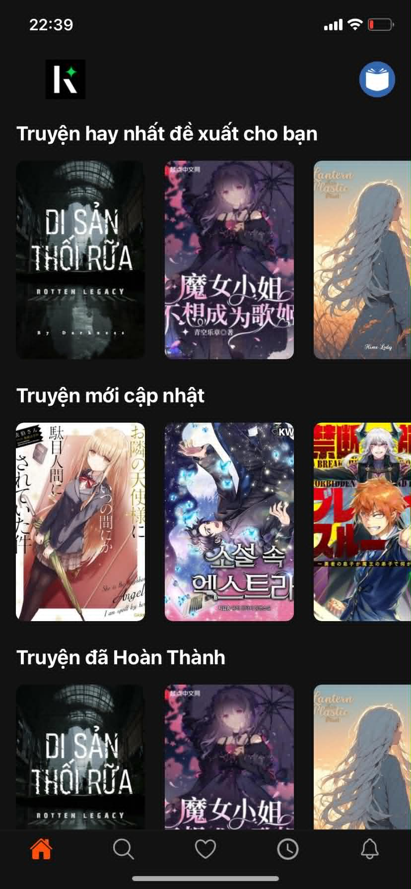
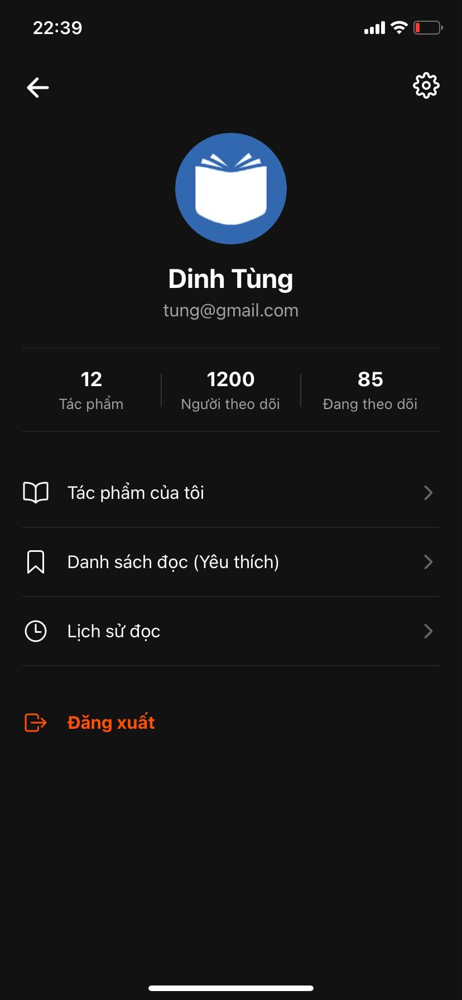
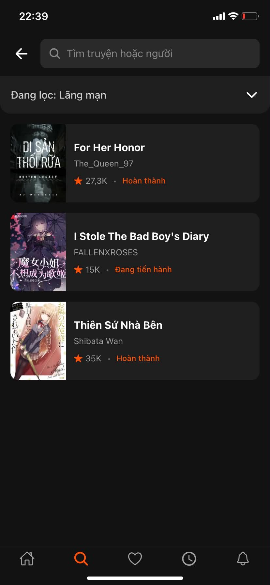
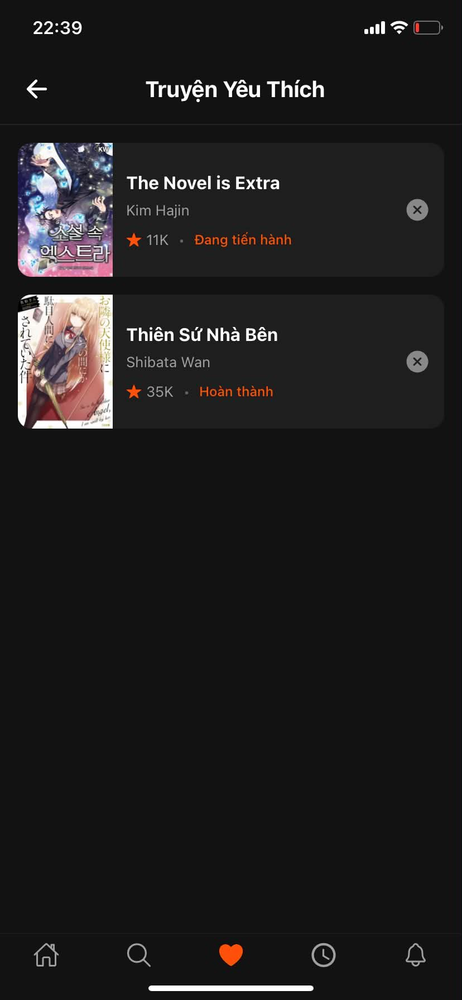
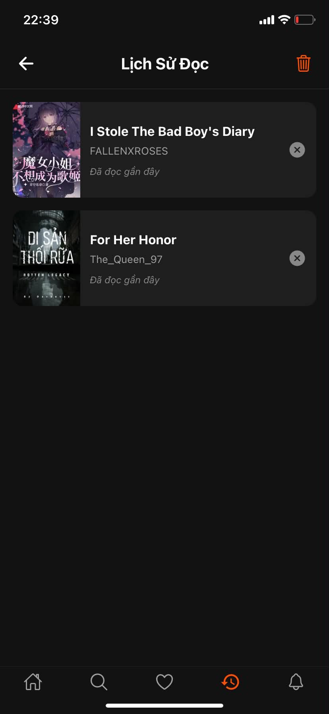
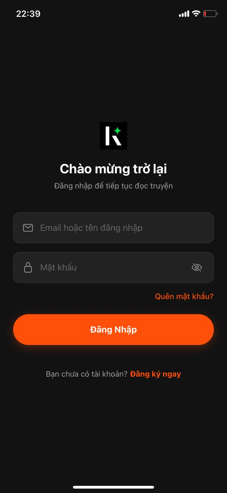
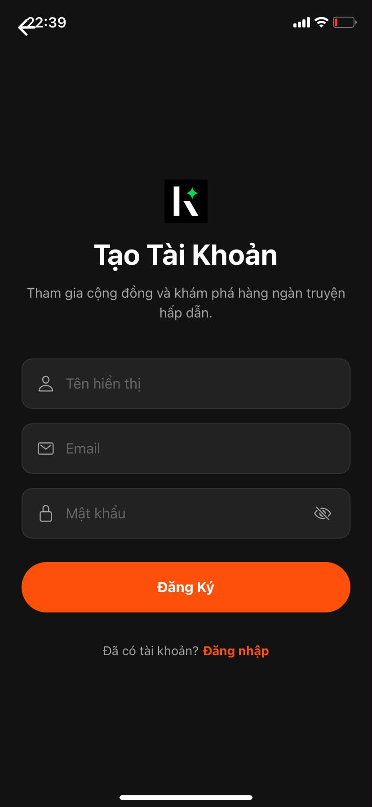

## Tên đề tài : Ứng dụng đọc truyện ngắn

## Giới thiệu:
Ứng dụng Đọc truyện ngắn là một nền tảng di động đa hệ điều hành được xây dựng trên hệ sinh thái React Native và Expo. Ứng dụng tập trung tối ưu hóa trải nghiệm cá nhân hóa của độc giả, quản lý bộ nhớ hệ thống một cách khoa học thông qua hệ thống tính năng toàn diện:
1. Tính năng cơ bản
* **Đăng nhập / Đăng ký:** Cổng xác thực an toàn bằng tài khoản Email và Mật khẩu, cho phép người dùng khởi tạo không gian đọc sách cá nhân và lưu trữ dữ liệu riêng biệt.
* **Trang chủ (HomeScreen):** Hiển thị danh sách các bộ truyện ngắn nổi bật, truyện mới cập nhật dưới dạng danh sách cuộn mượt mà (`FlatList`), kèm thông tin tóm tắt nhanh (lượt bầu chọn, trạng thái truyện).
* **Trang chi tiết truyện (StoryDetailScreen):** Cung cấp bức tranh toàn cảnh về bộ truyện bao gồm: ảnh bìa, tên tác giả, nội dung tóm tắt cốt truyện và danh sách toàn bộ các chương truyện hiện có.
* **Trang đọc nội dung (ReadingScreen):** Không gian hiển thị nội dung chữ tối giản, thoáng đãng, phân tách đoạn văn khoa học giúp người dùng tập trung hoàn toàn vào nội dung truyện.
* **Trang tìm kiếm (SearchScreen):** Công cụ đắc lực giúp người dùng nhanh chóng tìm ra bộ truyện yêu thích thông qua từ khóa tự do.
* **Trang yêu thích (FavoriteScreen):** Nơi lưu trữ bộ sưu tập các tác phẩm mà độc giả đã bấm nút yêu thích, giúp cá nhân hóa thư viện sách của từng người dùng.
* **Trang lịch sử đọc (HistoryScreen):** Nhật ký ghi nhận tự động những bộ truyện người dùng đã tương tác hoặc đọc dở gần đây để dễ dàng quay lại theo dõi.
* **Trang cá nhân (ProfileScreen):** Khu vực hiển thị thông tin hồ sơ của tài khoản đang đăng nhập và là nơi tích hợp nút đăng xuất an toàn khỏi hệ thống.
2. Tính năng nâng cao
**Quản lý xác thực thông minh (Authentication Flow):** Bảo mật hệ thống bằng cách chia tách cây điều hướng độc lập dựa trên trạng thái đăng nhập. Khi người dùng đăng xuất, toàn bộ dữ liệu truyện cũ sẽ lập tức bị xóa sạch khỏi bộ nhớ RAM, ngăn chặn hoàn toàn việc quay lại màn hình cũ bằng nút Back vật lý.
* **Bộ tùy chỉnh Font chữ nâng cao (Font Customizer Aa):** Cho phép độc giả chủ động thay đổi kích thước chữ to/nhỏ kèm cơ chế tự động co giãn khoảng cách dòng (`lineHeight`). Hệ thống tự động nhận diện hệ điều hành (Platform API) để áp dụng cấu hình font mượt mà (`Georgia` trên iOS và `serif` trên Android) chống lỗi vỡ giao diện.
* **Bộ lọc kép song song (Hybrid Search Matrix):** Thanh tìm kiếm tối ưu cho phép kết hợp lọc thời gian thực giữa từ khóa tự do (Tên truyện/Tác giả) và bảng chọn danh mục 16 thể loại truyện khác nhau có khả năng thu gọn/mở rộng linh hoạt.
* **Tối ưu hóa bộ nhớ điều hướng (`navigation.replace`):** Cơ chế chuyển chương truyện bằng cách thay thế màn hình cũ thay vì xếp chồng (Stack Push), giúp thiết bị luôn giải phóng RAM sạch sẽ dù độc giả có đọc liên tiếp hàng trăm chương truyện.
* **Lưu lịch sử đọc tự động (Background Auto-Tracking):** Sử dụng các hiệu ứng vòng đời ngầm để ghi nhận tiến độ đọc truyện của người dùng vào Context trung tâm ngay khi họ tương tác mà không cần thao tác thủ công.

## Danh sách thành viên : 
- Đinh Quang Tùng - Msv: 23810310337
- Vũ Minh Đạt - Msv: 23810310341
- Nguyễn Bá Đông - Msv: 23810310335

## Phân công công việc :
Đinh Quang Tùng : Phụ trách giao diện Home, hiển thị danh sách truyện, trang chi tiết truyện và chức năng đọc truyện/chương, logic điều hướng , AuthContext.
Vũ Minh Đạt : Phụ trách chức năng đăng nhập, đăng ký tài khoản, quản lý thông tin cá nhân và đăng xuất.
Nguyễn Bá Đông :Phụ trách chức năng tìm kiếm truyện, quản lý truyện yêu thích và lịch sử đọc truyện.

## Công nghệ sử dụng :
- React Native
- JavaScript
- React Context API
- React Navigation
- Platform API
- Git

## Hướng dẫn cài đặt
Yêu cầu máy tính đã cài đặt sẵn **Node.js (LTS)**.
1. **Cloning dự án từ Github về máy:**

   ```bash
   git clone [https://github.com/tungdinh123-hihi/App_Truyen]
   cd App_Truyen
2. **Cài đặt các thư viện phụ thuộc**
    npm install

## Hướng dẫn chạy project
1. Tại thư mục dự án chạy lệnh:
npx expo start
2. Xem ứng dụng
Cách 1 (Trên điện thoại thật ): * Tải ứng dụng Expo Go trên App Store (iOS) hoặc CH Play (Android).

Mở camera điện thoại quét mã QR Code hiển thị trên màn hình Terminal máy tính (Yêu cầu điện thoại và máy tính kết nối chung một mạng Wi-Fi).
Cách 2 (Trên trình duyệt Web): Bấm phím w tại Terminal máy tính để mở giao diện Web di động.
Cách 3 (Trên máy ảo): Bấm phím a cho máy ảo Android hoặc phím i cho máy ảo iPhone.

## Tài khoản Demo:
- Gmail: tung@Gmail.com
- Mật khẩu : 123456

##Ảnh minh hoạ:








## Link Video Demo: https://drive.google.com/drive/folders/1jo7UoiFST8nNbewc03xJoTrvOEwoIV_x
## Link Deploy: https://app-end.vercel.app/